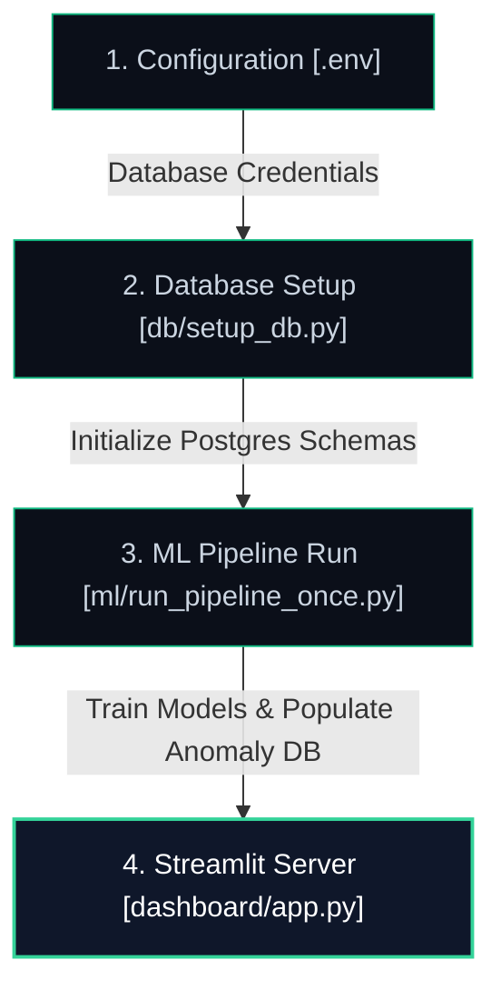

# ✦ FinOps Guard

### Autonomous Cloud Cost Intelligence & Remediation Engine
*Transforming raw multi-cloud billing telemetry into predictive, explainable financial decisions.*

---

## ✦ Beyond Observability: A Decision Intelligence System

Modern cloud environments suffer from uncontrolled resource sprawl, delayed detection of billing anomalies, and weak forecasting. Traditional observability platforms tell you *what* happened days after the invoice is cut.

**FinOps Guard** is a proactive cloud decision engine. Operating across multi-cloud environments, it ingests raw billing telemetry, isolates spend anomalies, attributes their exact root causes, and projects future spend trajectories to help finance and engineering teams optimize costs before overruns happen.

---

## ✦ System Architecture & Execution Sequence

To initialize the platform and generate the final executive spend analytics dashboard, execute the following components in sequence:



### ✦ Execution Steps

#### Step 1: Environment Configuration
Define your Neon PostgreSQL database credentials inside a `.env` file in the project root:
```env
DATABASE_URL=postgresql://<username>:<password>@<host>/<database>?sslmode=require
```

#### Step 2: Database Initialization
Run the schema setup script to construct all required database tables and index mappings:
```bash
python3 -m db.setup_db
```
*   **Action:** Truncates historical remnants and safely registers empty target relations for `anomaly_logs`, `daily_baselines`, `budget_forecasts`, and `model_metrics`.

#### Step 3: Run the ML Pipeline (Data Generation & Ingestion)
Train the AI ensemble models on historical telemetry data and synchronize anomalies and forecasts to the database:
```bash
python3 -m ml.run_pipeline_once
```
*   **Action:** Normalizes billing logs, engineers lag and rolling features, runs the consensus ensemble (Z-Score + Isolation Forest + LSTM), maps attributions, computes Prophet budget forecasts, and uploads the results.

#### Step 4: Launch the Executive Interface
Start the Streamlit dashboard server to visualize anomalies, attributions, and projections:
```bash
streamlit run dashboard/app.py
```
*   **Action:** Pulls daily baseline spend and real-time alerts from the Neon database to serve the high-fidelity executive control board.

---

## ✦ Core Intelligence Capabilities

### 1. Multi-Cloud Unification Taxonomy
Ingests and normalizes unstructured billing data from **AWS, Azure, and GCP** into a standardized telemetry format. Expenditures are categorized into `Compute`, `Storage`, `Networking`, and `Managed Services` to allow seamless cross-provider correlation.

### 2. 3-Layer Ensemble Anomaly Detection
Instead of relying on rigid thresholds, Guardian utilizes a highly optimized voting ensemble to neutralize false positives while detecting complex structural drift.

| Layer | Architecture | Objective |
| :--- | :--- | :--- |
| **Statistical** | `Z-Score` | Baseline variance & abrupt spike detection. |
| **Machine Learning** | `Isolation Forest` | Multidimensional pattern shifts against normal usage. |
| **Deep Learning** | `LSTM Autoencoder` | Chronological and temporal behavior embeddings. |

*Final trigger requires a majority vote (≥ 2 models consensus).*

### 3. Advanced Risk & Priority Engine
Financial anomalies are explicitly calculated against relative monetary impact, preventing engineering teams from wasting time on low-cost noise. 

> [!NOTE]
> `severity_score = model_votes / 3`  
> `impact_score = severity_score × cost_usd`

| Priority | Impact Trigger | Routing Action |
| :--- | :--- | :--- |
| **P0 - Critical** | Impact > $3,000 | Immediate intervention required. |
| **P1 - High** | Impact > $1,500 | High urgency review pipeline. |
| **P2 - Medium** | Impact > $500 | Monitor trend closely. |
| **P3 - Low** | Impact < $500 | Informational logging. |

### 4. Root-Cause Attributions
Raw anomalies are enriched natively with actionable context:
*   **Root Cause:** Identifies the architectural source.
*   **Insight Reasoning:** Explains the deviation logically.
*   **Recommended Action:** Exactly what to terminate, resize, or audit.
*   **Estimated Savings:** Hard dollar projections for remediation.

> [!TIP]
> *Example: "Unexpected data transfer spike → Misconfigured CDN external routing → Audit CDN usage & redirect VPC → Expected Savings $1000+"*

### 5. Multi-Horizon Forecasting Engine
Predicts future spend distributions across **7, 30, and 90-day** horizons.
Guardian utilizes **Prophet** for seasonal time-series extrapolation and **LightGBM** to evaluate feature-driven dependencies, generating robust **P10, P50, and P90** confidence intervals. 

### 6. Predictive Budget Breach Routing
Constantly maps the 90-day probability distributions against active monthly budget targets. By calculating the likelihood of spending exceeding limits, it isolates overspends and issues preemptive triggers *before* the infrastructure burns cash.

---

## ✦ Premium Redesigned Dark UI / UX

FinOps Guard has been redesigned from the ground up to feature an ultra-slick, minimal **Sage Emerald & Charcoal Carbon** executive theme.

*   **Sage Emerald Palette:** Replaced generic blue colors with professional emerald green (`#10b981`) and mint (`#34d399`) accents. Backdrops feature a deep radial gradient glowing from the dark carbon base (`#030712`).
*   **High-Contrast Readable Typography:** Eliminated low-contrast dark-grey texts. All descriptive subtitles, metrics, and KPI labels are rendered in bright, crisp **Platinum Silver** (`#cbd5e1`) and **Steel Gray** (`#94a3b8`) for absolute legibility.
*   **Fully Restored Expanded Sidebar:** The Control Panel sidebar is styled in rich solid black (`#000000`) and features a prominent `← Go to Home Page` navigation button to reset the dashboard state instantly.
*   **Telemetry Portal Ingestion State Machine:** The landing page features a robust `st.session_state` state controller. Pressing **"Run Demo Pipeline"** or uploading a CSV immediately disables all buttons and triggers a centered, upward-shifted glowing mint loader with spacious, collision-free margins.
*   **High-Fidelity Spend Baseline Continuity:** Persists both normal and anomalous days to Neon PostgreSQL. The Plotly chronology baseline renders as a smooth, continuous timeline curve with precise risk indicators overlaid perfectly on standard date keys.
*   **Collision-Free Donut Chart Labels:** Flips the layout coordinates inside the severity donut chart to render the bold signal counts on top and the uppercase text label cleanly below, preventing text collisions.

---

## ✦ Design Philosophy

1.  **Ensemble > Single Model:** Combining methodologies prevents adversarial system noise from disrupting alerts.
2.  **Explainability > Black Box:** AI has no value without attribution. We enforce SHAP and Linguistic derivations.
3.  **Prediction > Reaction:** You shouldn't manage costs; you should steer forecasts.
4.  **Impact > Noise:** We mute tiny fractional anomalies if the dollar-value impact is trivial, saving engineer fatigue.

---

<p align="center">
  <em>Cloud cost is not a monitoring problem. It is a decision problem. FinOps Guardian turns raw data into automated decisions.</em>
</p>

<p align="center">
  <b>Architected by Ayush Mali</b><br>
  <sub>Building intelligent, performant systems for high-scale enterprise operations.</sub>
</p>
